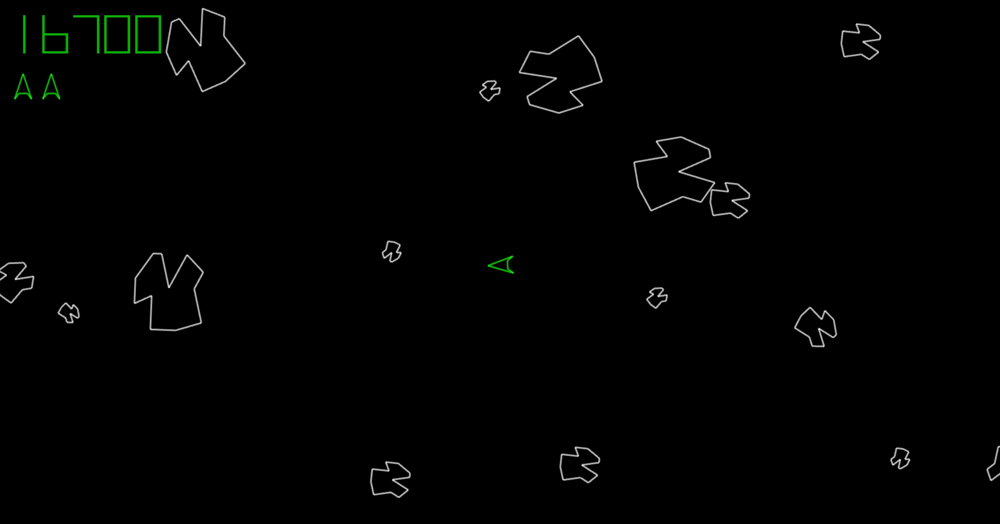

# blasteroids
Classic asteroid game written in pure c with the allegro library.    
Marcelo Camargo, 2018.

To compile and run on Ubuntu 20.04:

0. Install Allegro library:   
`sudo apt update`  
`sudo apt install liballegro5-dev allegro5-doc`

1. Install git in case you do not have it:  
`sudo apt install git`

2. Clone the repository.  
If you do not now how, please follow these instructions: 
[Cloning a repository](https://docs.github.com/en/repositories/creating-and-managing-repositories/cloning-a-repository)

3. Change the directory to the applications's:  
`cd blasteroids`

4. Compile:  
`gcc blasteroids.c asteroids.c blast.c main.c point.c score.c utils.c wireframe.c spaceship.c -o blaster -lallegro -lallegro_image -lallegro_color -lallegro_primitives -lallegro_font -lallegro_ttf -lallegro_audio -lallegro_acodec -lm` 

5. Run and play:  
`./blaster`
   

